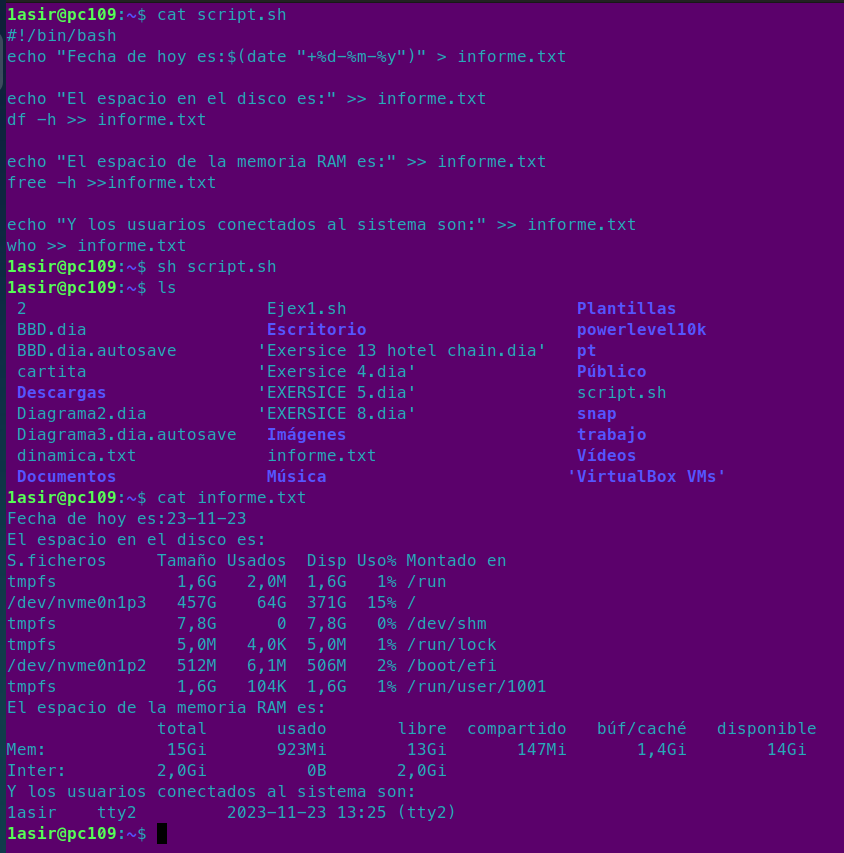

# Redireccionamiento

## Ejercicio de direcciones

### Enunciado: Genera un archivo llamado informes.txt que contenga la siguiente informacion: La fecha del sistema formateada en día, mes y año. El espacio en disco. La memoria libre del sistema. Usuarios conectados en el sistema.

!Hay que subir imagen de que el script ha sido ejecutado con exito¡.

*(Estos son los comandos que tenemos que usar en el script)*
```
date "+%d-%m-%y" > informe.txt
df -h >> informe.txt
free -h >> informe.txt
who >> informe.txt
```
--- 
### Ejercicio resuelto


